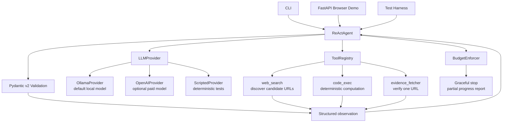
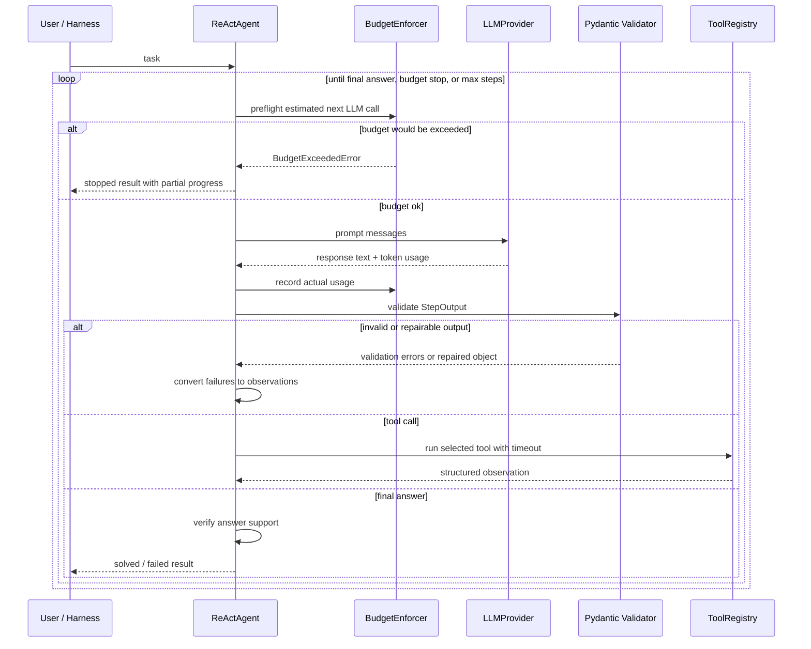

# Resource-Constrained Agentic Planning Loop

## Architecture Overview
This project implements a hand-rolled ReAct agent with hard resource limits. A CLI, deterministic harness, and optional FastAPI browser demo all call the same `ReActAgent`. A `BudgetEnforcer` gates every LLM call, an `LLMProvider` abstraction supports Ollama and OpenAI, Pydantic v2 schemas validate every model step, and a timeout-protected tool registry exposes exactly three tools: web search, code execution, and evidence fetching.

Detailed diagrams are also kept in `docs/diagrams.md`.





## Planning Loop
ReAct is a good fit because it makes each cycle explicit: think, act, observe, then decide whether progress is being made. Its weakness is that it is greedy and myopic: it chooses each next step from local context only, so without guardrails it can wander, loop, or overspend. This is why the implementation adds hard budget enforcement, structured observations, repeated-action detection, and progress assessment in every step.

For exact arithmetic, the LLM still chooses `code_exec` as the action. After the real tool observation returns stdout, the controller can terminate from that verified stdout instead of asking a small local model to copy the number again.

## Schema Design
State moves through typed Pydantic v2 models. The model must return a `StepOutput` with `thought`, `progress_assessment`, `is_stuck`, optional `new_plan`, and an action. Tool inputs and observations are typed separately, so invalid model output or invalid tool input becomes a structured observation instead of an unhandled crash.

## Prompt Strategy
The system prompt requires one JSON object per LLM step and describes the three tool boundaries. It tells the model to use `web_search` for discovery, `evidence_fetcher` for source verification, and `code_exec` for bounded computation. It also frames the agent as resource-constrained: each step must assess progress, change strategy when stuck, and stop honestly instead of retrying blindly. Reflection is folded into the same step through `progress_assessment` and `is_stuck` so the agent does not waste separate LLM calls on reflection.

## Failure Modes
One observed failure mode is malformed model output. The agent handles this by validating the output with Pydantic and adding a recoverable `agent_validation` observation. Another expected failure is budget exhaustion on broad research requests; the budget gate stops execution and reports completed work.

## Future Work
The current implementation uses a lightweight evidence fetcher rather than a full retrieval pipeline. With more time, I would add source quality scoring and cached fetches so repeated tasks can reuse verified evidence without spending more tool time.

## Setup
Install dependencies with `uv`:

```bash
uv sync
```

Run the deterministic five-task harness:

```bash
uv run agentic-planner run-tests
```

Run one task with the configured provider:

```bash
uv run agentic-planner run "Find a current source explaining Docker multi-stage builds."
```

Start an interactive session:

```bash
uv run agentic-planner chat
```

Show live loop progress while the task runs:

```bash
uv run agentic-planner chat --verbose
```

The default output is a readable terminal summary. Add `--json` when you want the full
machine-readable trace:

```bash
uv run agentic-planner run --json "Find a current source explaining Docker multi-stage builds."
```

By default, `.env.example` is configured for Ollama and DDGS web search. DDGS does not require an API key. Copy `.env.example` to `.env`, start Ollama locally, and set `OLLAMA_MODEL` to an installed model. To use OpenAI, set `AGENT_LLM_PROVIDER=openai` and provide `OPENAI_API_KEY`. To use Tavily instead of DDGS, set `WEB_SEARCH_PROVIDER=tavily` and provide `TAVILY_API_KEY`.

For Ollama, cost is simulated with `LOCAL_MODEL_PRICE_PER_1K_TOKENS` as required by the assignment. For OpenAI, token counts come from the OpenAI API response and are priced with `OPENAI_INPUT_PRICE_PER_1M_TOKENS` and `OPENAI_OUTPUT_PRICE_PER_1M_TOKENS`; update those values if you change models or OpenAI pricing changes.

## Docker
Build and run the deterministic assignment harness:

```bash
docker build -t resource-constrained-agent .
docker run --rm resource-constrained-agent
```

Run the browser demo locally:

```bash
docker run --rm -p 8000:8000 --env-file .env resource-constrained-agent agentic-planner-web
```

Then open `http://localhost:8000`. This is the local demo URL. If deployed to a container host
such as Render, Fly.io, Railway, or Azure Container Apps, use the hosted HTTPS URL in the
submission form.

For live OpenAI, Tavily, or Ollama runs, pass your environment file:

```bash
docker run --rm --env-file .env resource-constrained-agent
```

For Ollama from Docker Desktop on Windows or macOS, use `OLLAMA_HOST=http://host.docker.internal:11434`.

## Deployment
For a public demo URL, deploy the Docker web app as a Render Web Service.

Use these settings:

```text
Runtime: Docker
Dockerfile Path: ./Dockerfile
Docker Build Context Directory: .
Docker Command: agentic-planner-web
Health Check Path: /health
```

Set secrets in Render, not in Git:

```text
AGENT_LLM_PROVIDER=openai
OPENAI_API_KEY=...
WEB_SEARCH_PROVIDER=tavily
TAVILY_API_KEY=...
```

After deploy, use the Render HTTPS URL as the submission demo URL.

## Validation
```bash
uv run pytest
uv run ruff check .
uv run ruff format --check .
uv run ty check
```
