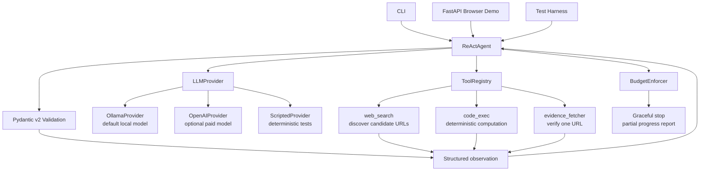
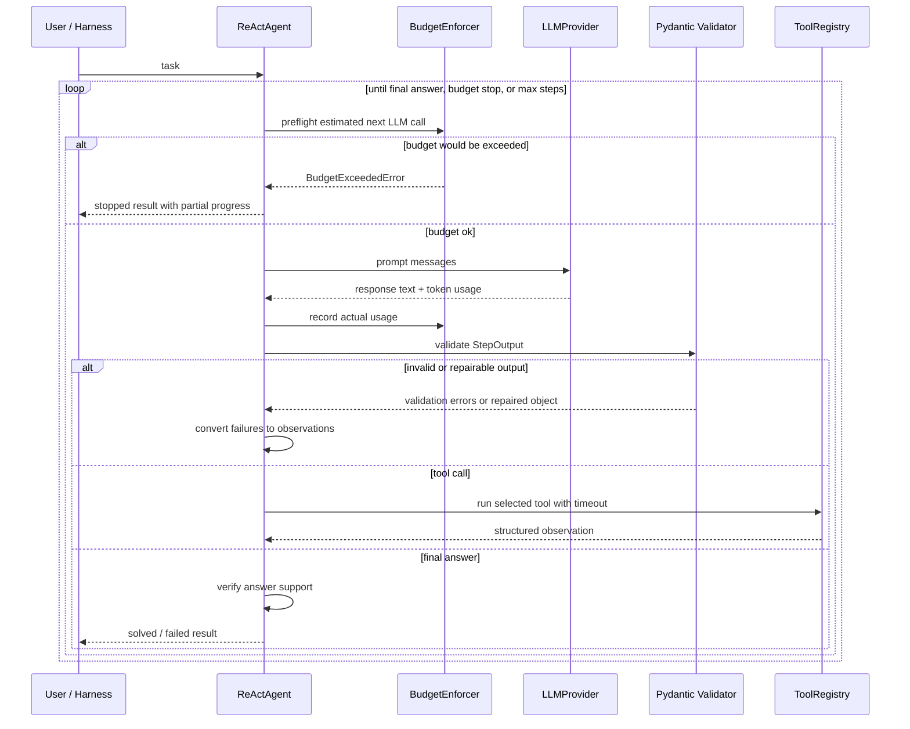
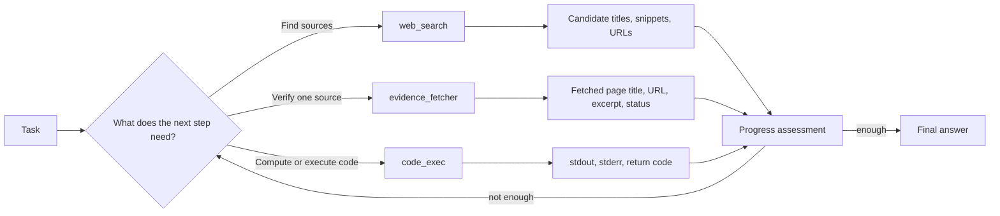
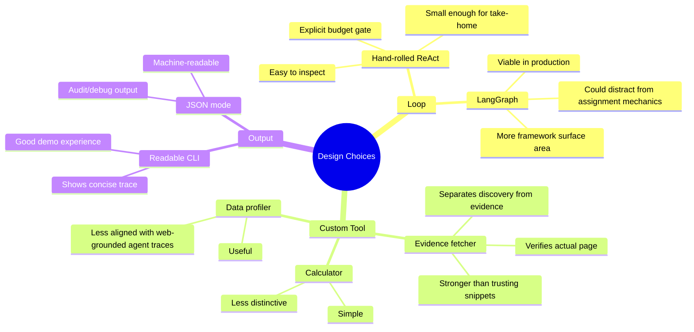

# Architecture And Flow Diagrams

These diagrams are the presentation-friendly version of the system design. They are intentionally small enough to explain in an interview without hiding the core control flow.

## Final Architecture



## Runtime Step Flow



## Tool Boundary



## Arithmetic Guardrail Flow

```mermaid
flowchart TD
    MathTask[Exact arithmetic task] --> LLM[LLM proposes action or answer]
    LLM --> Guess{Final answer without code_exec support?}
    Guess -->|yes| Reject[Reject final answer<br/>create progress_monitor observation]
    Reject --> Replan[Replan]
    Replan --> Code[code_exec: print(expression)]
    Code --> Stdout[stdout value]
    Stdout --> ControllerFinal[Controller can finalize from verified stdout]
    Guess -->|no, uses code_exec| Code
```

## Brainstorming / Tradeoff Map



## Reviewer Talking Point

The core claim is:

> The LLM proposes, but the controller enforces.

That means the model can make mistakes, but the system still has explicit checks for budget, schemas, tool failures, answer support, and graceful stopping.
